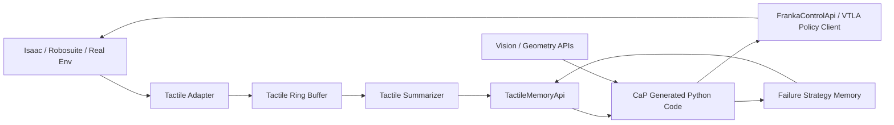

# CaP + 触觉记忆设计文档

本文档描述如何把 CaP-X 的 code-as-policies 框架和 Tabero / VTLA 的触觉信号结合起来。目标不是把触觉原始数组直接塞进大模型 prompt，而是把触觉转换成可执行代码能够查询、判断和复用的状态接口，让 CaP 具备失败诊断和策略修正能力。

## 目标

核心研究问题：

```text
当视觉策略失败时，触觉事件能否帮助 code policy 诊断失败原因，并生成更好的 retry / adjustment 策略？
```

第一阶段的目标应尽量小：

- 不训练新的大模型；
- 不把 marker 原始大数组直接给 LLM；
- 不先做复杂长期记忆系统；
- 只证明 CaP 生成的 Python 策略能根据触觉状态做条件分支；
- 再证明触觉条件分支能提高一批失败任务的成功率。

## 基本判断

CaP 和触觉结合时，触觉不应该只是“第三张图片”或“额外文本描述”。更合理的定位是：

```text
触觉 = 执行过程中的接触状态、失败证据、策略修正条件
```

因此推荐架构是：

```text
视觉 / 几何 API
    +
触觉 ring buffer
    ↓
TactileState / TactileMemory
    ↓
TactileMemoryApi
    ↓
CaP 生成 Python 代码
    ↓
代码根据触觉状态选择 grasp / retry / force adjustment / abort
```

CaP 负责高层可解释策略，Tabero / VTLA / Isaac 负责低层动作和触觉观测。

## 为什么不直接把触觉原始数据给 LLM

Tabero 的 marker motion 通常类似：

```text
[S, T, M, 2]
```

或者训练侧历史形式：

```text
tactile_marker_motion: [9, 198, 2]
```

这里面包含大量连续数值。直接转成文本或 JSON 给 LLM 有几个问题：

- token 开销高；
- LLM 对连续二维形变场的数值推理不稳定；
- 很难保证每次 prompt 格式一致；
- 无法自然表达“接触事件”“滑动趋势”“左右接触不均衡”；
- 容易把研究问题变成 prompt engineering，而不是触觉记忆。

所以第一版应该把原始触觉压缩成结构化 summary 和 event。

## 现有系统切入点

CaP-X 的关键路径：

```text
cap-x/capx/integrations/base_api.py
cap-x/capx/integrations/__init__.py
cap-x/capx/envs/tasks/base.py
cap-x/env_configs/*/*.yaml
```

其中：

- `ApiBase` 定义工具 API；
- `combined_doc()` 会把 API 函数 docstring 放进 prompt；
- `CodeExecutionEnvBase` 会把 API 函数绑定到 LLM 生成代码的全局命名空间；
- YAML 中的 `apis` 字段决定暴露哪些函数。

Tabero / Isaac 触觉相关切入点：

```text
Tabero/source/tac_manip/tac_manip/tasks/manipulation/libero/mdp/observations.py
Tabero-VTLA/docs/tactile_integration.md
```

已有触觉形式：

- `tactile_image`：触觉 RGB 图像；
- `tactile_marker_motion`：marker displacement / force-field；
- `tactile_gripper_force`：夹爪 force history；
- VTLA 训练侧已经能把 `tactile_prefix` / `tactile_suffix` 编码成 token。

CaP 侧第一版应复用这些观测，但不要直接进入 VLA 训练路径。

## 推荐架构



第一阶段可以不实现 `Failure Strategy Memory`，只实现 `TactileMemoryApi` 的即时状态查询。

## 数据结构设计

### TactileFrame

一帧触觉观测，用于 ring buffer 内部存储：

```python
{
    "timestamp": float,
    "left_marker_delta": np.ndarray,   # [M, 2]
    "right_marker_delta": np.ndarray,  # [M, 2]
    "left_force": np.ndarray | None,   # [3] or [6]
    "right_force": np.ndarray | None,  # [3] or [6]
    "gripper_width": float | None,
}
```

### TactileSummary

给 CaP 代码读取的稳定结构：

```python
{
    "contact": bool,
    "left_contact": bool,
    "right_contact": bool,
    "normal_force": float,
    "shear_magnitude": float,
    "slip_score": float,
    "contact_balance": float,
    "max_marker_displacement": float,
    "mean_marker_displacement": float,
    "event": str,
}
```

字段含义：

- `contact`：是否存在有效接触；
- `normal_force`：近似法向压力或 force norm；
- `shear_magnitude`：切向形变强度；
- `slip_score`：滑动风险分数；
- `contact_balance`：左右手指接触是否均衡；
- `event`：离散事件，例如 `no_contact`、`stable_grasp`、`slip_detected`、`left_edge_contact`。

### TactileMemoryRecord

第二阶段之后用于失败策略记忆：

```python
{
    "task": "put the alphabet soup in the basket",
    "scene_id": "libero_10/task_0",
    "failure_type": "slip_during_lift",
    "tactile_evidence": {
        "slip_score": 0.81,
        "contact_balance": -0.65,
        "event": "right_contact_lost"
    },
    "strategy": {
        "description": "retry with deeper grasp and slower lift",
        "code_patch": "..."
    },
    "outcome": {
        "success": true,
        "retry_count": 1
    }
}
```

## API 设计

新增一个 API：

```text
TactileMemoryApi
```

建议文件位置：

```text
cap-x/capx/integrations/tactile/memory_api.py
```

注册位置：

```text
cap-x/capx/integrations/__init__.py
```

配置示例：

```yaml
apis:
  - FrankaControlApi
  - TactileMemoryApi
```

### 第一版函数

```python
def get_tactile_summary(window: int = 20) -> dict:
    """
    Return a compact tactile summary over the recent window.

    Args:
        window: Number of recent tactile frames to aggregate.

    Returns:
        A dictionary with contact, force, shear, slip_score, contact_balance,
        max_marker_displacement, and event.
    """
```

```python
def is_contacting(threshold: float = 0.2) -> bool:
    """
    Return whether the gripper is currently in contact with an object.
    """
```

```python
def is_slipping(threshold: float = 0.6) -> bool:
    """
    Return whether recent tactile motion indicates object slip.
    """
```

```python
def is_grasp_stable() -> bool:
    """
    Return whether contact is present, balanced, and not slipping.
    """
```

```python
def wait_until_contact(timeout: float = 2.0, threshold: float = 0.2) -> dict:
    """
    Step or monitor the environment until tactile contact is detected.
    Returns the tactile summary at contact or timeout.
    """
```

```python
def get_recent_tactile_events(window: int = 50) -> list[str]:
    """
    Return a list of recent discrete tactile events such as no_contact,
    stable_grasp, slip_detected, or contact_lost.
    """
```

### 第二版函数

```python
def remember_failure_strategy(failure_type: str, tactile_evidence: dict, strategy: str) -> None:
    """
    Store a structured tactile failure strategy for later retrieval.
    """
```

```python
def retrieve_tactile_strategy(task: str, tactile_summary: dict, top_k: int = 3) -> list[dict]:
    """
    Retrieve similar tactile failure strategies for the current task and tactile state.
    """
```

## 代码生成示例

CaP 生成的策略代码应该能写出下面这种逻辑：

```python
import numpy as np

pick_pos, pick_quat = sample_grasp_pose("red cube")
goto_pose(pick_pos, pick_quat, z_approach=0.1)
close_gripper()

summary = get_tactile_summary(window=20)

if not summary["contact"]:
    # Move slightly deeper and retry contact.
    retry_pos = pick_pos.copy()
    retry_pos[2] -= 0.01
    goto_pose(retry_pos, pick_quat, z_approach=0.03)
    close_gripper()

if is_slipping():
    # Slow down and regrasp instead of lifting immediately.
    open_gripper()
    retry_pos = pick_pos.copy()
    retry_pos[0] += 0.01
    goto_pose(retry_pos, pick_quat, z_approach=0.05)
    close_gripper()

if is_grasp_stable():
    lift_pos = pick_pos.copy()
    lift_pos[2] += 0.2
    goto_pose(lift_pos, pick_quat)
else:
    RESULT = {"failed": "unstable_grasp", "tactile_summary": get_tactile_summary()}
```

这类代码的关键价值是：失败判断来自触觉，不来自视觉成功标签。

## Prompt 设计

任务 prompt 中应明确告诉模型：

```text
You may use tactile APIs to verify contact and detect slip after grasping.
Do not assume the object is grasped only because the gripper is closed.
If tactile contact is missing or slip is detected, retry with a small pose adjustment.
Use get_tactile_summary(), is_contacting(), is_slipping(), and is_grasp_stable()
before lifting or placing the object.
```

不要写：

```text
The tactile signal tells you whether the task will succeed.
```

因为这会把触觉变成 oracle 标签，实验不成立。

## 三阶段实现路线

### 阶段 1：即时触觉 API

目标：

```text
CaP 能根据触觉状态做 if / retry / abort。
```

实现：

- 新增 `TactileMemoryApi`；
- 用 rule-based summarizer 计算 contact / slip / balance；
- 暴露 `get_tactile_summary()` 等函数；
- 配置一个带触觉 API 的 CaP task；
- 先用少量失败场景做 smoke。

这一阶段不需要训练，不需要 memory bank。

### 阶段 2：接入 Tabero / Isaac 触觉

目标：

```text
CaP 高层策略 + Tabero 低层 tactile policy / Isaac tactile observation。
```

可选连接方式：

1. 同进程方式：CaP 直接包 Isaac env；
2. 服务方式：Isaac client 提供 HTTP / ZeroMQ tactile endpoint；
3. 离线 replay：从已有评测 logs / tactile videos / marker arrays 中回放触觉。

推荐先用服务方式：

```text
Isaac tactile client -> Tactile server -> CaP TactileMemoryApi
```

这样 CaP-X 和 Isaac Lab 环境不必强行装在一个 Python 环境里。

### 阶段 3：失败策略记忆

目标：

```text
将失败触觉模式和修正代码显式存储，下次检索复用。
```

流程：

```text
执行失败
  ↓
提取 tactile summary / event sequence
  ↓
归因 failure_type
  ↓
保存 strategy memory
  ↓
下一次相似 tactile event 检索策略
  ↓
CaP prompt 中加入 retrieved strategy
```

这一步才是“触觉记忆”的核心论文点。

## 最小实验设计

选择 Tabero 中已经复现但成功率低的任务，而不是本来就 100% 成功的任务。

对比组：

```text
A. Tabero-VTLA 原始 checkpoint
B. CaP + 视觉 / 几何 API，无触觉
C. CaP + 即时触觉 summary
D. CaP + 即时触觉 summary + failure strategy memory
```

每组记录：

- success rate；
- retry 次数；
- 失败类型；
- 是否发生 slip；
- 是否接触缺失；
- 任务完成时间；
- 视频证据；
- 触觉事件时间线。

最低判断标准：

```text
C 相比 B 提升：说明即时触觉反馈有用。
D 相比 C 提升：说明显式触觉策略记忆有用。
A 和 C/D 对比：说明 CaP 触觉策略是否能补足 VTLA 闭环失败。
```

## 失败类型分类

建议第一版只分这几类：

```text
no_contact_after_close
unstable_grasp
slip_during_lift
one_finger_contact
over_force_contact
placement_collision
timeout
unknown
```

触觉主要负责区分：

- 没接触；
- 只接触一边；
- 抓住后滑动；
- 压力过大；
- 放置时撞击。

## 防止实验泄漏

需要避免：

- 把 `success` 或 reward 直接传给 LLM；
- 把真实 press count / trial id / eval label 给 LLM；
- 用任务结束状态反推触觉事件；
- prompt 中写死某个 task 的成功策略；
- 只在成功样本上构建 memory。

可以允许：

- 当前触觉 summary；
- 最近触觉 event；
- 历史失败 strategy；
- LLM 自己生成 retry 代码；
- 视频用于人工分析，不进入策略输入。

## 和隐式触觉记忆的关系

Tabero-VTLA 的触觉 token 是隐式记忆路线：

```text
marker history -> tactile encoder -> model hidden state -> action
```

CaP + TactileMemoryApi 是显式记忆路线：

```text
marker history -> event / summary / memory record -> code branch -> action
```

两者不是互斥关系。更合理的论文结构是：

```text
VTLA 提供低层动作先验；
CaP 提供可解释高层策略；
触觉 memory 提供失败诊断和策略复用。
```

也就是说，CaP 触觉记忆不是替代 Tabero，而是补足 Tabero 在失败恢复和策略选择上的弱点。

## 第一周建议任务

```text
Day 1:
  写 TactileMemoryApi 设计和数据结构，不接 Isaac。

Day 2:
  用已有 tactile marker / force log 做离线 summarizer，输出 contact/slip/balance。

Day 3:
  在 CaP-X 中注册 TactileMemoryApi，让 prompt 能看到函数文档。

Day 4:
  构造一个 toy tactile state，验证 LLM 生成代码会调用 is_slipping/is_grasp_stable。

Day 5:
  接一个失败任务，跑 B/C 两组，保存代码、日志、视频和 tactile event timeline。
```

## 后续落地文件建议

```text
cap-x/capx/integrations/tactile/__init__.py
cap-x/capx/integrations/tactile/memory_api.py
cap-x/capx/integrations/tactile/summarizer.py
cap-x/capx/integrations/tactile/ring_buffer.py
cap-x/capx/integrations/tactile/strategy_memory.py
cap-x/env_configs/libero_tactile/*.yaml
capx_scripts/run_capx_tactile_smoke.sh
capx_scripts/run_capx_tactile_eval.sh
```

第一版只需要前三个：

```text
memory_api.py
summarizer.py
ring_buffer.py
```

## 当前结论

最小可行路线是：

```text
先做 CaP + 即时触觉 summary，
再做 CaP + 触觉失败策略 memory，
最后再考虑把隐式触觉 latent 和显式 code memory 统一起来。
```

这条路线工程量可控，也能和现有 Tabero / PI05 LoRA checkpoint 形成互补，不会把研究问题重新退回到“再训练一个触觉 VLA”。

